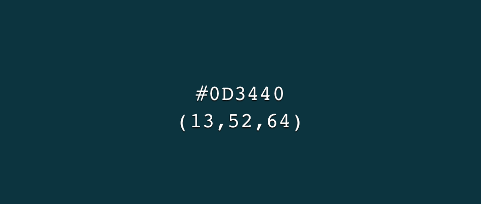
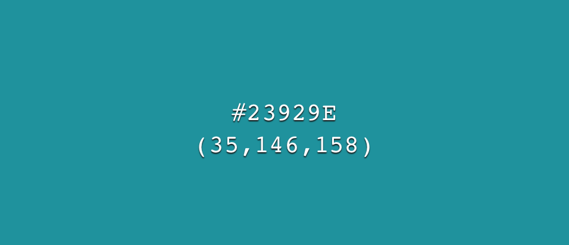
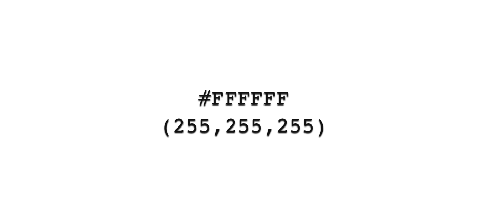

# PyMCon Branding

This section contains PyMCon’s branding standards and guidelines.  
File types:    
- `AI` is the filename extension used by Adobe Illustrator
- `SVG` Scalable Vector Graphics (SVG) are an XML-based markup language for describing two-dimensional based vector graphics. They can be created and edited with any text editor or with drawing software.
- `PNG` is a higher-quality compression format; size of file is generally larger
- `JPG` images are generally of lower quality, but are faster to load

 

## Suggestions for Viewing in Darkmode
Some logos may be difficult to view due to being white color on a white background.  In the Chrome browser, to view Dark moode
- GitHub: [Update theme appearance](https://github.com/settings/appearance)
- [How to Turn on Dark Mode in Google Chrome](https://www.lifewire.com/turn-on-dark-mode-chrome-5222724).

## PyMCon: Font, Colors & Logos
 

### Font
- [Montserrat](https://fonts.google.com/specimen/Montserrat)

 

### Color Palette

 

 

### Colors: Individual

| | |
| - | - |
|  `RGB (13,52,64) HEX #0D3440` More info: [#0D3440](https://www.color-hex.com/color/0D3440) ᠎|  `RGB (18,73,90) HEX #12495A` More info: [#12495A](https://www.color-hex.com/color/12495A)  &nbsp;|
|  `RGB (24,99,122) HEX #18637A` More info: [#18637A](https://www.color-hex.com/color/18637A) ᠎|  `RGB (35,146,158) HEX #23929E`  More info: [#23929E](https://www.color-hex.com/color/23929E)  &nbsp;| 
| `RGB (46,186,201) HEX #2EBAC9` More info: [#2EBAC9](https://www.color-hex.com/color/2EBAC9) |  `RGB (255, 255, 255) HEX #FFFFFF` More info: [#504A4E](https://www.color-hex.com/color/ffffff)  &nbsp;| 

 

### Logos 

| | |
| - | - |
|   | __Logo 1__   File type: PNG   File size: 36.1 KB (1080 x 800 px)   File name: <a href="https://github.com/pymc/pymc-devs/brand/pymcon_logos/PNG/logo pymcon - color.png">logo pymcon - color</a> | 
|   | __Logo 2__   File type: PNG   File size: 34.2 KB (1080 x 800 px)   File name: <a href="https://github.com/pymc/pymc-devs/brand/pymcon_logos/PNG/logo pymcon - for blue background.png">logo pymcon - color</a> | 
|   | __Logo 3__   File type: PNG   File size: 33.7 KB (1080 x 800 px)   File name: <a href="https://github.com/pymc/pymc-devs/brand/pymcon_logos/PNG/logo pymcon - black.png">logo pymcon - black</a> | 
|   | __Logo 4__   File type: PNG   File size: 34.1 KB (1080 x 800 px)   File name: <a href="https://github.com/pymc/pymc-devs/brand/pymcon_logos/PNG/logo pymcon - for light blue background.png">logo pymcon - for light blue background</a> | 
|   | __Logo 5__   File type: PNG   File size: 31.4 KB (1080 x 800 px)   File name: <a href="https://github.com/pymc/pymc-devs/brand/pymcon_logos/PNG/logo pymcon - white.png">logo pymcon - white</a> | 
|   | __Logo 6__   File type: PNG   File size: 17 KB (1080 x 800 px)   File name: <a href="https://github.com/pymc/pymc-devs/brand/pymcon_logos/PNG/logo pymcon text - black.png">logo pymcon text - black.png</a> | 
|   | __Logo 7__   File type: PNG   File size: 16.9 KB (1080 x 800 px)   File name: <a href="https://github.com/pymc/pymc-devs/brand/pymcon_logos/PNG/logo pymcon - light blue text.png">logo pymcon - light blue text</a> | 
|   | __Logo 8__   File type: PNG   File size: 16.9 KB (1080 x 800 px)   File name: <a href="https://github.com/pymc/pymc-devs/brand/pymcon-logos/PNG/logo pymcon - white text.png">logo pymcon - white text</a> | 
|   | &nbsp;  __Logo 9__   File type: PNG   File size: 59.9 KB (1080 x 800 px)   File name: <a href="https://github.com/pymc/pymc-devs/brand/pymcon_logos/PNG/logo pymcon horizontal - color.png">logo pymcon horizontal - color</a>   &nbsp; | 
|   | &nbsp;  __Logo 10__   File type: PNG   File size: 49.1 KB (1080 x 800 px)   File name: <a href="https://github.com/pymc/pymc-devs/brand/pymcon_logos/PNG/logo pymcon horizontal - white.png">logo pymcon horizontal - white</a>  &nbsp; | 
|  | &nbsp;  __Logo 11__   File type: PNG   File size: 52.5 KB (1080 x 800 px)   File name: <a href="https://github.com/pymc/pymc-devs/brand/pymcon-logos/PNG/logo pymcon horizontal - black.png">logo pymcon horizontal - black</a>  &nbsp; | 
|   | &nbsp;  __Logo 12__   File type: PNG   File size: 55.7 KB (1080 x 800 px)   File name: <a href="https://github.com/pymc/pymc-devs/brand/pymcon_logos/PNG/logo pymcon horizontal - for blue background.png">logo pymcon horizontal - for blue background</a>  &nbsp; | 
|   | &nbsp;  __Logo 13__   File type: PNG   File size: 55.7 KB (1080 x 800 px)   File name: <a href="https://github.com/pymc/pymc-devs/brand/pymcon_logos/PNG/logo pymcon horizontal - for light blue background.png">logo pymcon horizontal - for light blue background</a>  &nbsp; | 
|   | __Logo 14__   File type: PNG   File size: 38.1 KB (1080 x 800 px)   File name: <a href="https://github.com/pymc/pymc-devs/brand/pymcon-logos/PNG/logo pymcon isotype - black.png">logo pymcon isotype - black</a> | 
|   | __Logo 15__   File type: PNG   File size: 43.2 KB (1080 x 800 px)   File name: <a href="https://github.com/pymc/pymc-devs/brand/pymcon-logos/PNG/logo pymcon isotype.png">logo pymcon isotype</a> | 
|   | __Logo 16__   File type: PNG   File size: 36 KB (1080 x 800 px)   File name: <a href="https://github.com/pymc/pymc-devs/brand/pymcon-logos/PNG/logo pymcon isotype - white.png">logo pymcon isotype - white</a> | 

 

### References
- [PyMCon website source repository](https://github.com/pymc-devs/pymcon_web_series_website) 
- [color-hex](https://www.color-hex.com): Glossary of Color Palettes
